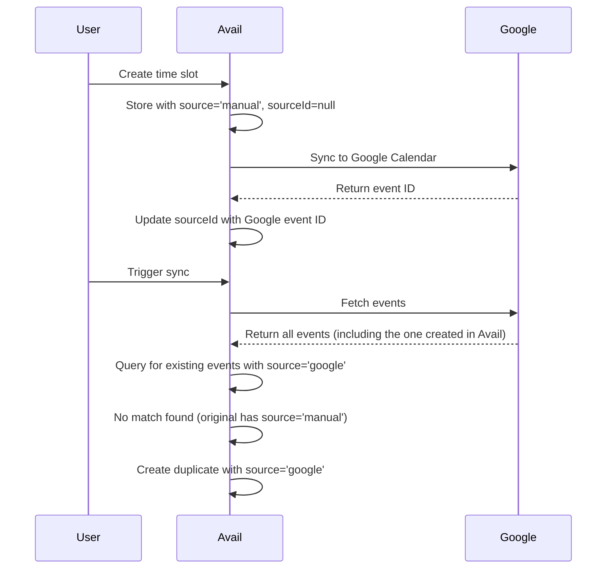
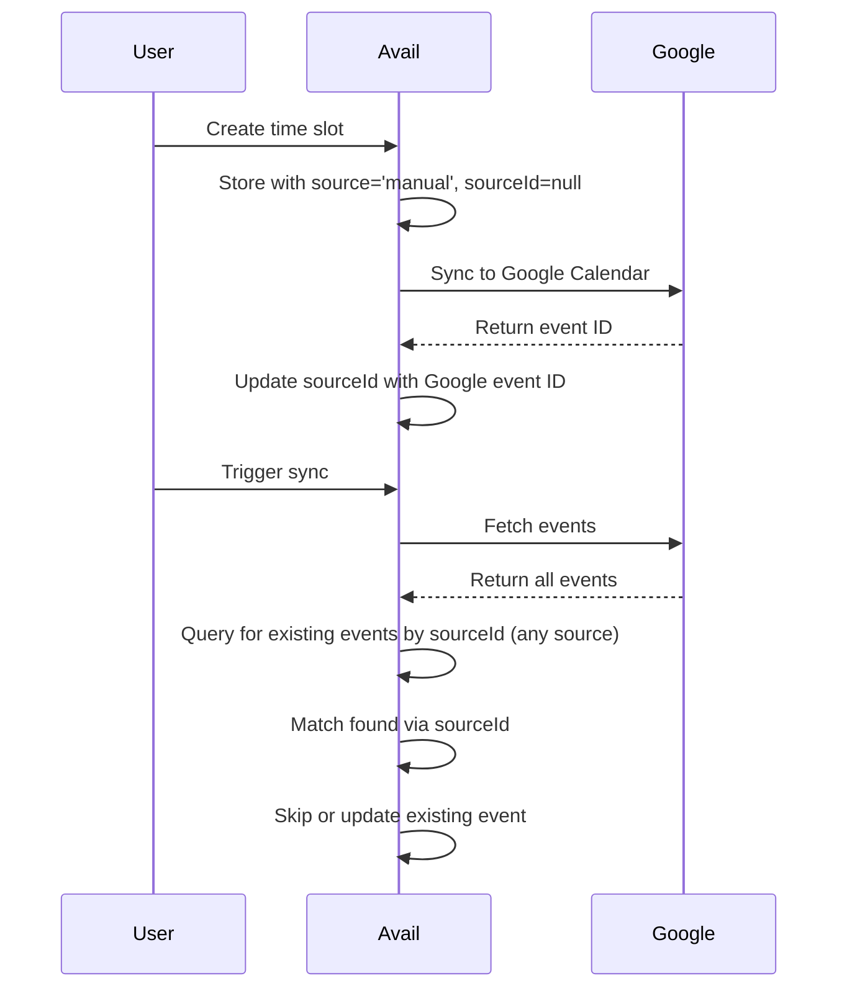

# Design Document

## Overview

This design addresses the Google Calendar sync duplication bug by modifying the sync logic to properly identify existing time slots regardless of their source attribute. The key insight is that the `sourceId` field (Google Calendar event ID) should be the primary identifier for matching events during sync, not the `source` attribute.

## Architecture

The fix will be implemented in the `GoogleCalendarService.syncFromGoogle()` method within `lib/services/google-calendar.service.ts`. No database schema changes are required as the existing `sourceId` field already serves the purpose of tracking Google Calendar event IDs.

### Current Flow (Buggy)



### Fixed Flow



## Components and Interfaces

### Modified Method: `GoogleCalendarService.syncFromGoogle()`

**Location:** `lib/services/google-calendar.service.ts`

**Changes:**

1. **Query Modification**: Change the database query to fetch all events with a non-null `sourceId` within the date range, regardless of the `source` attribute value.

2. **Matching Logic**: Use `sourceId` as the primary key for matching Google Calendar events to existing Avail time slots.

3. **Update Logic**: When a match is found, update the existing time slot regardless of its `source` value.

4. **Deletion Logic**: Delete any time slot with a sourceId that's no longer in Google Calendar, regardless of source. This provides full bidirectional sync where deletions in Google Calendar are reflected in Avail.

5. **Logging**: Add debug logging to track when duplicates are prevented.

### Data Flow

```
Input: userId, startDate, endDate
↓
Fetch events from Google Calendar API
↓
Fetch ALL Avail events with sourceId != null in date range
↓
Create Map: sourceId → CalendarEvent
↓
For each Google event:
  - Check if sourceId exists in map
  - If exists: Update if changed
  - If not exists: Create new with source='google'
↓
Delete orphaned events (sourceId not in Google results)
↓
Return: { created, updated, deleted }
```

## Data Models

No changes to the Prisma schema are required. The existing `CalendarEvent` model already has the necessary fields:

```prisma
model CalendarEvent {
  id          String      @id @default(cuid())
  userId      String
  title       String
  description String?
  startTime   DateTime
  endTime     DateTime
  timezone    String
  location    String?
  source      EventSource @default(manual)
  sourceId    String?     // Google Calendar event ID
  createdAt   DateTime    @default(now())
  updatedAt   DateTime    @updatedAt
  user        User        @relation(fields: [userId], references: [id], onDelete: Cascade)
}

enum EventSource {
  manual
  google
}
```

## Error Handling

### Edge Cases

1. **Null or Empty SourceId**: The query will use `sourceId != null` to filter, and the Map lookup will naturally handle missing keys.

2. **Concurrent Modifications**: The current implementation doesn't handle concurrent sync operations. This is acceptable for the current fix, but should be noted for future improvements.

3. **Partial Sync Failures**: If the Google Calendar API call fails mid-sync, the transaction will roll back naturally since each operation is atomic.

4. **Token Expiration**: Already handled by `refreshTokenIfNeeded()` before the sync operation.

### Error Scenarios

| Scenario | Current Behavior | Expected Behavior | Handling |
|----------|------------------|-------------------|----------|
| Google API unavailable | Throws error, returns 500 | Same | No change needed |
| Invalid date range | Returns validation error | Same | No change needed |
| Event without ID | Skips event | Same | No change needed |
| Duplicate sourceId in DB | Uses first match | Same | Acceptable for this fix |

## Testing Strategy

### Unit Tests

Not required for this fix as per the minimal testing approach. The fix is straightforward and can be validated through manual testing.

### Manual Testing Scenarios

1. **Scenario 1: Create and Sync**
   - Create a time slot in Avail
   - Verify it syncs to Google Calendar
   - Trigger sync from Google
   - Verify no duplicate is created

2. **Scenario 2: Multiple Syncs**
   - Create a time slot in Avail
   - Trigger sync multiple times
   - Verify only one time slot exists

3. **Scenario 3: Update in Google**
   - Create a time slot in Avail
   - Modify it in Google Calendar
   - Trigger sync
   - Verify the Avail time slot is updated (not duplicated)

4. **Scenario 4: Delete in Google (Bidirectional Sync)**
   - Create a time slot in Avail (source='manual')
   - Delete it from Google Calendar
   - Trigger sync
   - Verify the Avail time slot is also deleted (bidirectional sync)

5. **Scenario 5: Native Google Event**
   - Create an event directly in Google Calendar
   - Trigger sync
   - Verify it's created in Avail with source='google'
   - Trigger sync again
   - Verify no duplicate is created

## Deletion Logic Decision

The sync will implement full bidirectional deletion behavior. When an event with a sourceId is deleted from Google Calendar, it will also be deleted from Avail during the next sync, regardless of whether it was originally created in Avail (source='manual') or Google Calendar (source='google').

**Rationale:**
- Maintains strict consistency between Avail and Google Calendar
- Provides intuitive sync behavior where both calendars stay in sync
- Simpler mental model: what's in Google is what's in Avail
- Users expect "sync" to mean the calendars are identical

**Important Note:**
Events created in Avail that have NOT been synced to Google (sourceId is null) will never be deleted by the sync operation. Only events that have a Google Calendar counterpart (sourceId is not null) can be deleted during sync.

## Implementation Notes

### Key Changes Summary

1. Change the Prisma query from:
   ```typescript
   where: {
     userId,
     source: EventSource.google,
     startTime: { gte: startDate },
     endTime: { lte: endDate },
   }
   ```
   
   To:
   ```typescript
   where: {
     userId,
     sourceId: { not: null },
     startTime: { gte: startDate },
     endTime: { lte: endDate },
   }
   ```

2. Update the deletion logic for full bidirectional sync:
   ```typescript
   const deletedEvents = availsEvents.filter(
     (e) => e.sourceId && !googleEventIds.has(e.sourceId)
   );
   ```
   - Deletes any event with a sourceId that's no longer in Google Calendar
   - Maintains strict sync consistency between Avail and Google
   - Applies to both manually created events and Google-sourced events

3. Add logging for duplicate prevention:
   ```typescript
   if (existingEvent) {
     console.log('[Sync] Found existing event, checking for updates:', {
       id: existingEvent.id,
       source: existingEvent.source,
       sourceId: existingEvent.sourceId,
     });
   }
   ```

### Performance Considerations

The change from filtering by `source` to filtering by `sourceId != null` should have minimal performance impact:
- Both fields are likely to be indexed
- The result set size should be similar or smaller (only events with sourceId)
- The Map lookup remains O(1)

### Backward Compatibility

This fix is fully backward compatible:
- No database migrations required
- No API changes
- Existing time slots will work correctly
- The fix prevents future duplicates without affecting existing data
