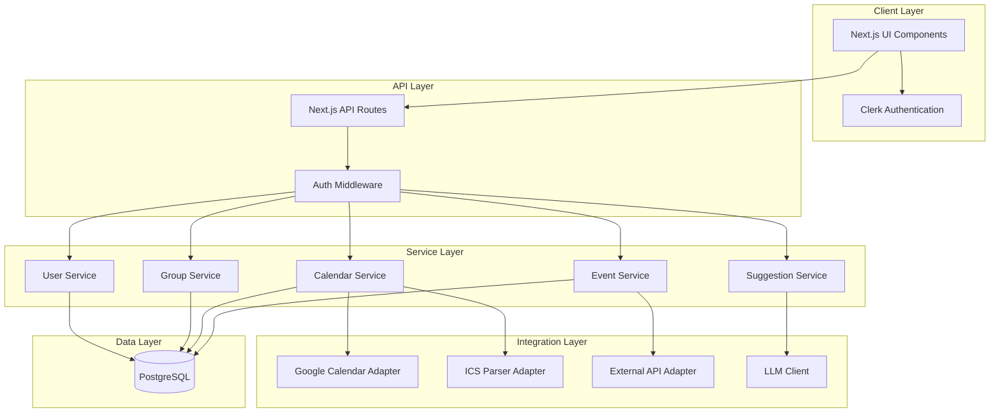

# Design Document

## Overview

The Group Activity Planner is a full-stack Next.js application that combines authentication (Clerk), database persistence (PostgreSQL), calendar integration (Google Calendar API + ICS), event aggregation from external APIs, and AI-powered recommendations (LLM). The architecture follows a modular approach with clear separation between data access, business logic, and presentation layers.

## Architecture

### High-Level Architecture



### Technology Stack

- **Frontend**: Next.js 14+ (App Router), React, TypeScript, Tailwind CSS, shadcn/ui components
- **Authentication**: Clerk
- **Database**: PostgreSQL (Vercel Postgres or Neon)
- **ORM**: Prisma or Drizzle ORM
- **Calendar Integration**: googleapis, ical.js
- **Date Handling**: date-fns
- **Deployment**: Vercel
- **LLM Integration**: OpenAI API or Anthropic Claude

## Components and Interfaces

### 1. Authentication Integration (Clerk)

**Clerk Setup**:
- Middleware protection for authenticated routes
- Webhook handlers for user lifecycle events (create, update, delete)
- User metadata sync with PostgreSQL

**Key Files**:
- `middleware.ts` - Route protection
- `app/api/webhooks/clerk/route.ts` - Sync Clerk users to database
- `lib/auth.ts` - Auth utilities

### 2. Database Schema

**Core Tables**:

```typescript
// User
- id: string (primary key, Clerk user ID)
- email: string
- name: string
- createdAt: timestamp
- updatedAt: timestamp

// UserInterest
- id: uuid (primary key)
- userId: string (foreign key -> User)
- interest: string
- createdAt: timestamp

// UserBudget
- id: uuid (primary key)
- userId: string (foreign key -> User, unique)
- minBudget: decimal
- maxBudget: decimal
- currency: string (default 'EUR')
- updatedAt: timestamp

// Group
- id: uuid (primary key)
- name: string
- ownerId: string (foreign key -> User)
- createdAt: timestamp
- updatedAt: timestamp

// GroupMember
- id: uuid (primary key)
- groupId: uuid (foreign key -> Group)
- userId: string (foreign key -> User)
- joinedAt: timestamp
- unique(groupId, userId)

// GroupInvitation
- id: uuid (primary key)
- groupId: uuid (foreign key -> Group)
- invitedEmail: string
- invitedBy: string (foreign key -> User)
- status: enum ('pending', 'accepted', 'declined')
- token: string (unique)
- createdAt: timestamp
- expiresAt: timestamp

// CalendarEvent (Unified Event Interface)
- id: uuid (primary key)
- userId: string (foreign key -> User)
- title: string
- description: text (nullable)
- startTime: timestamp with timezone
- endTime: timestamp with timezone
- timezone: string
- location: string (nullable)
- source: enum ('google', 'ics', 'manual')
- sourceId: string (nullable, external ID from source)
- createdAt: timestamp
- updatedAt: timestamp

// ExternalEvent
- id: uuid (primary key)
- title: string
- description: text
- startTime: timestamp with timezone
- endTime: timestamp with timezone
- timezone: string
- location: string (nullable)
- cost: decimal (nullable)
- currency: string (default 'EUR')
- category: string
- sourceApi: string (e.g., 'eventbrite', 'ticketmaster')
- sourceId: string
- sourceUrl: string
- createdAt: timestamp
- updatedAt: timestamp
- unique(sourceApi, sourceId)

// ActivitySuggestion
- id: uuid (primary key)
- groupId: uuid (foreign key -> Group)
- externalEventId: uuid (foreign key -> ExternalEvent, nullable)
- title: string
- description: text
- suggestedTime: timestamp with timezone
- cost: decimal (nullable)
- reasoning: text (LLM explanation)
- createdAt: timestamp
```

### 3. Unified Event Interface

**TypeScript Interface**:

```typescript
interface UnifiedEvent {
  id: string;
  title: string;
  description?: string;
  startTime: Date;
  endTime: Date;
  timezone: string;
  location?: string;
  source: 'google' | 'ics' | 'manual' | 'external';
  sourceId?: string;
  metadata?: Record<string, any>;
}
```

**Event Adapters**:

```typescript
// Google Calendar Adapter
class GoogleCalendarAdapter {
  async fetchEvents(accessToken: string, timeMin: Date, timeMax: Date): Promise<UnifiedEvent[]>
  private transformGoogleEvent(googleEvent: calendar_v3.Schema$Event): UnifiedEvent
}

// ICS Parser Adapter
class ICSParserAdapter {
  async parseICSFile(fileContent: string): Promise<UnifiedEvent[]>
  private transformICSEvent(icsEvent: any): UnifiedEvent
}

// External API Adapter
class ExternalEventAdapter {
  private transformToUnifiedEvent(externalEvent: ExternalEvent): UnifiedEvent
}
```

### 4. Service Layer

**UserService**:
- `createUser(clerkId, email, name)` - Create user from Clerk webhook
- `getUserById(userId)` - Fetch user details
- `updateUserInterests(userId, interests)` - Update user interests
- `updateUserBudget(userId, minBudget, maxBudget)` - Update budget

**GroupService**:
- `createGroup(ownerId, name)` - Create new group
- `inviteToGroup(groupId, email, invitedBy)` - Send invitation
- `acceptInvitation(token, userId)` - Accept group invitation
- `getGroupMembers(groupId)` - Fetch all members
- `leaveGroup(groupId, userId)` - Remove user from group

**CalendarService**:
- `syncGoogleCalendar(userId, accessToken)` - Fetch and store Google Calendar events
- `importICSFile(userId, fileContent)` - Parse and store ICS events
- `addManualEvent(userId, eventData)` - Create manual event
- `getUserEvents(userId, startDate, endDate)` - Fetch user's calendar events

**EventService**:
- `fetchExternalEvents()` - Aggregate events from external APIs
- `getEventsByCategory(category)` - Filter external events
- `getEventsByBudget(minBudget, maxBudget)` - Filter by cost

**SuggestionService**:
- `generateSuggestions(groupId)` - Create AI-powered activity suggestions
- `findAvailableTimeSlots(groupId)` - Identify common availability
- `filterEventsByGroupPreferences(groupId, events)` - Match events to group criteria

### 5. API Routes

**Authentication**:
- `POST /api/webhooks/clerk` - Clerk user sync webhook

**User Management**:
- `GET /api/user/profile` - Get current user profile
- `PUT /api/user/interests` - Update user interests
- `PUT /api/user/budget` - Update user budget

**Group Management**:
- `POST /api/groups` - Create group
- `GET /api/groups` - List user's groups
- `POST /api/groups/[id]/invite` - Send invitation
- `POST /api/groups/[id]/accept` - Accept invitation
- `DELETE /api/groups/[id]/leave` - Leave group
- `GET /api/groups/[id]/members` - Get group members

**Calendar Integration**:
- `POST /api/calendar/google/auth` - Initiate Google OAuth
- `GET /api/calendar/google/callback` - Handle OAuth callback
- `POST /api/calendar/google/sync` - Trigger Google Calendar sync
- `POST /api/calendar/ics/upload` - Upload ICS file
- `POST /api/calendar/events` - Add manual event
- `GET /api/calendar/events` - Get user's events

**Activity Suggestions**:
- `POST /api/groups/[id]/suggestions` - Generate suggestions for group
- `GET /api/groups/[id]/suggestions` - Get existing suggestions

**External Events**:
- `GET /api/events/external` - Browse external events (with filters)

### 6. Google Calendar Integration

**OAuth Flow**:
1. User clicks "Connect Google Calendar"
2. Redirect to Google OAuth consent screen
3. User grants permissions
4. Callback receives authorization code
5. Exchange code for access token and refresh token
6. Store tokens securely (encrypted in database)
7. Fetch calendar events using googleapis

**Token Storage**:
```typescript
// GoogleCalendarToken table
- id: uuid (primary key)
- userId: string (foreign key -> User, unique)
- accessToken: string (encrypted)
- refreshToken: string (encrypted)
- expiresAt: timestamp
- createdAt: timestamp
- updatedAt: timestamp
```

**Sync Strategy**:
- Initial sync: Fetch events from past 30 days to future 90 days
- Incremental sync: Use `syncToken` for efficient updates
- Scheduled sync: Cron job every 6 hours

### 7. LLM Integration

**Prompt Structure**:
```typescript
interface SuggestionPrompt {
  groupMembers: {
    interests: string[];
    budget: { min: number; max: number };
  }[];
  availableTimeSlots: {
    start: Date;
    end: Date;
  }[];
  externalEvents: {
    title: string;
    description: string;
    time: Date;
    cost: number;
    category: string;
  }[];
}
```

**LLM Service**:
- Format group data into structured prompt
- Request suggestions from LLM (OpenAI GPT-4 or Claude)
- Parse LLM response into structured suggestions
- Store suggestions in database

## Data Models

### Prisma Schema Example

```prisma
model User {
  id        String   @id
  email     String   @unique
  name      String
  createdAt DateTime @default(now())
  updatedAt DateTime @updatedAt

  interests        UserInterest[]
  budget           UserBudget?
  ownedGroups      Group[]              @relation("GroupOwner")
  groupMemberships GroupMember[]
  calendarEvents   CalendarEvent[]
  googleToken      GoogleCalendarToken?
}

model CalendarEvent {
  id          String   @id @default(uuid())
  userId      String
  title       String
  description String?
  startTime   DateTime
  endTime     DateTime
  timezone    String
  location    String?
  source      EventSource
  sourceId    String?
  createdAt   DateTime @default(now())
  updatedAt   DateTime @updatedAt

  user User @relation(fields: [userId], references: [id], onDelete: Cascade)

  @@index([userId, startTime])
}

enum EventSource {
  google
  ics
  manual
}
```

## Error Handling

### Error Categories

1. **Authentication Errors**: Invalid Clerk session, expired tokens
2. **Validation Errors**: Invalid input data, missing required fields
3. **Integration Errors**: Google API failures, ICS parsing errors, external API timeouts
4. **Database Errors**: Connection failures, constraint violations
5. **LLM Errors**: API rate limits, invalid responses

### Error Response Format

```typescript
interface ErrorResponse {
  error: {
    code: string;
    message: string;
    details?: any;
  };
}
```

### Retry Strategy

- Google Calendar API: Exponential backoff (3 retries)
- External Event APIs: Circuit breaker pattern
- LLM API: Retry with fallback to simpler prompt

## Testing Strategy

### Unit Tests
- Event adapters (Google, ICS, External)
- Service layer business logic
- Utility functions (date handling, validation)

### Integration Tests
- API routes with mocked database
- Calendar sync workflows
- Group invitation flow

### End-to-End Tests
- User authentication and profile setup
- Group creation and invitation acceptance
- Calendar import and event display
- Activity suggestion generation

### Test Tools
- Jest for unit tests
- React Testing Library for component tests
- Playwright for E2E tests
- Mock Service Worker (MSW) for API mocking

## Security Considerations

1. **Authentication**: All API routes protected by Clerk middleware
2. **Authorization**: Users can only access their own data and groups they belong to
3. **Token Encryption**: Google OAuth tokens encrypted at rest
4. **Input Validation**: Zod schemas for all API inputs
5. **Rate Limiting**: Implement rate limits on API routes
6. **CORS**: Restrict to Vercel domain only
7. **Environment Variables**: Sensitive keys stored in Vercel environment variables

## Performance Optimization

1. **Database Indexing**: Index on userId, groupId, startTime for calendar queries
2. **Caching**: Redis cache for external events (1-hour TTL)
3. **Pagination**: Implement cursor-based pagination for event lists
4. **Lazy Loading**: Load calendar events on-demand by date range
5. **Background Jobs**: Use Vercel Cron for scheduled tasks (event aggregation, calendar sync)

## Deployment Configuration

### Environment Variables

```
# Clerk
NEXT_PUBLIC_CLERK_PUBLISHABLE_KEY=
CLERK_SECRET_KEY=
CLERK_WEBHOOK_SECRET=

# Database
DATABASE_URL=

# Google Calendar
GOOGLE_CLIENT_ID=
GOOGLE_CLIENT_SECRET=
GOOGLE_REDIRECT_URI=

# LLM
OPENAI_API_KEY=

# External APIs
EVENTBRITE_API_KEY=
TICKETMASTER_API_KEY=
```

### Vercel Configuration

- **Build Command**: `npm run build`
- **Output Directory**: `.next`
- **Install Command**: `npm install`
- **Framework**: Next.js
- **Node Version**: 18.x or higher

### Database Migration Strategy

- Use Prisma migrations for schema changes
- Run migrations in CI/CD pipeline before deployment
- Maintain backward compatibility during rolling deployments

## Future Enhancements

1. **Real-time Updates**: WebSocket support for live group activity updates
2. **Mobile App**: React Native app with shared API
3. **Calendar Providers**: Support for Outlook, Apple Calendar
4. **Event RSVP**: Allow group members to RSVP to suggested activities
5. **Notification System**: Email/push notifications for invitations and suggestions
6. **Analytics Dashboard**: Track group activity and suggestion acceptance rates
