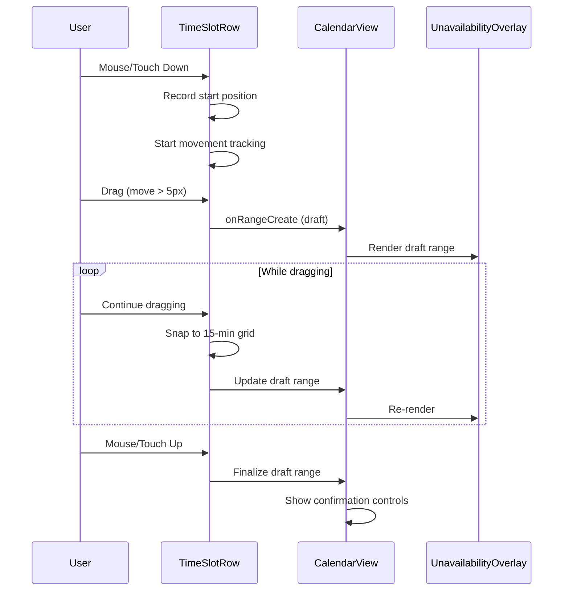
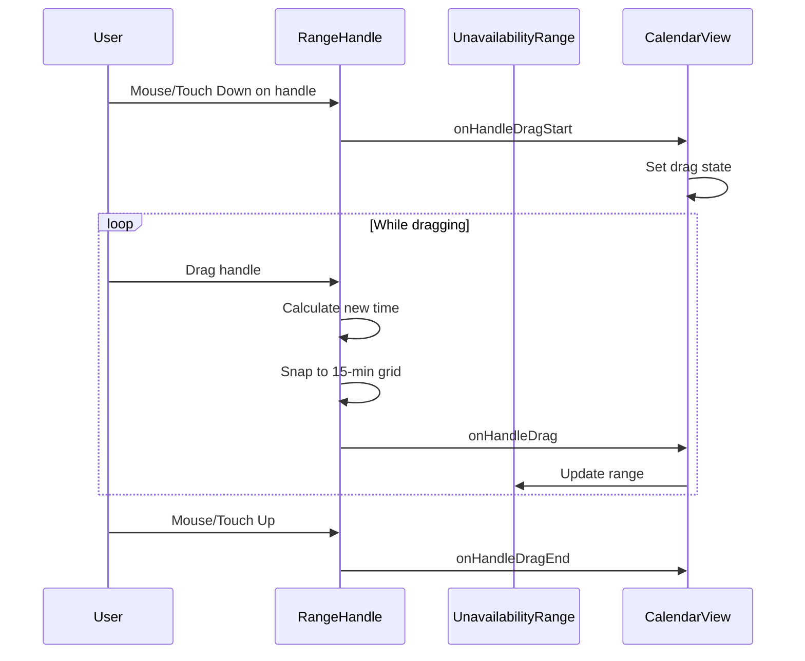
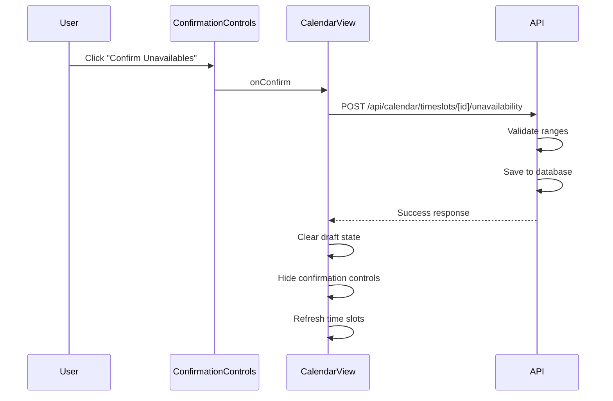
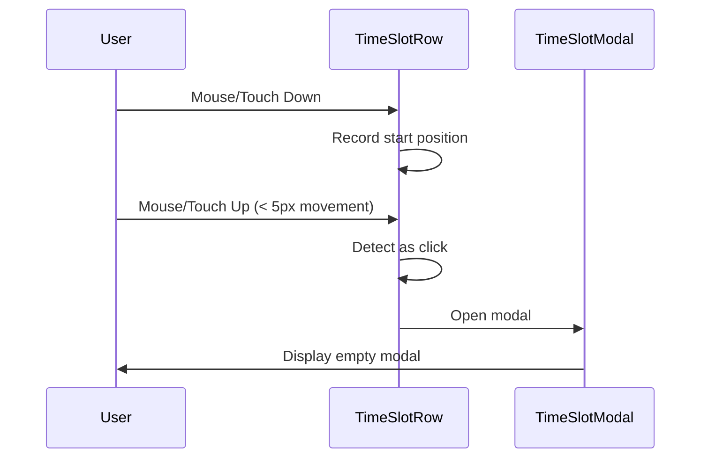

# Design Document

## Overview

This feature adds interactive drag-to-select functionality to time slot rows in the calendar view, allowing users to mark unavailable periods within their available time slots. The implementation uses a combination of mouse/touch event handlers, visual overlays, and state management to create a smooth, intuitive user experience. The feature integrates with the existing calendar system and introduces a new data model for storing unavailability ranges.

### Key Design Principles

1. **Non-destructive editing**: Unavailability ranges are created in a draft state and only persisted when confirmed
2. **15-minute granularity**: All selections snap to 15-minute intervals for consistency
3. **Visual clarity**: Orange highlighting clearly distinguishes unavailable periods from available time
4. **Mobile-first**: Touch interactions are first-class citizens alongside mouse interactions
5. **Progressive enhancement**: Simple clicks still work for existing modal functionality

## Architecture

### Component Structure

```
CalendarView (existing)
├── TimeSlotRow (new)
│   ├── UnavailabilityOverlay (new)
│   │   ├── UnavailabilityRange (new)
│   │   │   ├── RangeHandle (start)
│   │   │   ├── TimeLabel (start)
│   │   │   ├── TimeLabel (end)
│   │   │   └── RangeHandle (end)
│   │   └── [multiple ranges...]
│   └── TimeSlotModal (new, empty for now)
└── ConfirmationControls (new, in header)
```

### State Management

The feature uses React state at the CalendarView level to manage:

1. **Draft unavailability ranges**: Array of ranges being created/edited
2. **Interaction state**: Current drag operation, selected range, etc.
3. **Confirmation mode**: Whether confirmation controls should be visible

```typescript
interface UnavailabilityRange {
  id: string; // Temporary ID for draft ranges
  timeSlotId: string;
  startTime: Date;
  endTime: Date;
  isNew: boolean; // Distinguishes new ranges from persisted ones
}

interface DragState {
  isDragging: boolean;
  dragType: 'create' | 'resize-start' | 'resize-end' | null;
  timeSlotId: string | null;
  startPosition: number | null;
  currentRange: UnavailabilityRange | null;
}
```

## Components and Interfaces

### 1. TimeSlotRow Component

**Purpose**: Wraps each time slot card to add interactive drag-to-select functionality

**Props**:
```typescript
interface TimeSlotRowProps {
  timeSlot: TimeSlot;
  unavailabilityRanges: UnavailabilityRange[];
  onRangeCreate: (range: UnavailabilityRange) => void;
  onRangeUpdate: (rangeId: string, updates: Partial<UnavailabilityRange>) => void;
  onRangeDelete: (rangeId: string) => void;
  onClick: (timeSlot: TimeSlot) => void;
  viewMode: 'day' | 'week';
}
```

**Responsibilities**:
- Detect mouse/touch down events on the time slot
- Calculate time position based on cursor/touch position
- Distinguish between click and drag (5px threshold)
- Render the UnavailabilityOverlay
- Forward simple clicks to modal handler

**Event Handling**:
```typescript
// Mouse events
onMouseDown: (e) => handlePointerDown(e.clientX)
onMouseMove: (e) => handlePointerMove(e.clientX)
onMouseUp: (e) => handlePointerUp()

// Touch events
onTouchStart: (e) => handlePointerDown(e.touches[0].clientX)
onTouchMove: (e) => handlePointerMove(e.touches[0].clientX)
onTouchEnd: (e) => handlePointerUp()
```

### 2. UnavailabilityOverlay Component

**Purpose**: Renders all unavailability ranges within a time slot as positioned overlays

**Props**:
```typescript
interface UnavailabilityOverlayProps {
  timeSlot: TimeSlot;
  ranges: UnavailabilityRange[];
  onRangeUpdate: (rangeId: string, updates: Partial<UnavailabilityRange>) => void;
  isDragging: boolean;
}
```

**Responsibilities**:
- Position ranges absolutely within the time slot bounds
- Calculate pixel positions from time values
- Render individual UnavailabilityRange components
- Handle range merging when overlaps occur

**Position Calculation**:
```typescript
function calculateRangePosition(
  range: UnavailabilityRange,
  timeSlot: TimeSlot,
  containerWidth: number
): { left: number; width: number } {
  const slotDuration = timeSlot.endTime.getTime() - timeSlot.startTime.getTime();
  const rangeStart = range.startTime.getTime() - timeSlot.startTime.getTime();
  const rangeDuration = range.endTime.getTime() - range.startTime.getTime();
  
  const leftPercent = (rangeStart / slotDuration) * 100;
  const widthPercent = (rangeDuration / slotDuration) * 100;
  
  return {
    left: (leftPercent / 100) * containerWidth,
    width: (widthPercent / 100) * containerWidth,
  };
}
```

### 3. UnavailabilityRange Component

**Purpose**: Renders a single unavailability range with handles and time labels

**Props**:
```typescript
interface UnavailabilityRangeProps {
  range: UnavailabilityRange;
  position: { left: number; width: number };
  onHandleDragStart: (rangeId: string, handle: 'start' | 'end') => void;
  onHandleDrag: (rangeId: string, newTime: Date) => void;
  onHandleDragEnd: () => void;
}
```

**Styling**:
```css
.unavailability-range {
  position: absolute;
  background-color: rgba(249, 115, 22, 0.3); /* Orange with opacity */
  border: 2px solid rgb(249, 115, 22);
  border-radius: 4px;
  height: 100%;
  pointer-events: auto;
}

.range-handle {
  position: absolute;
  width: 12px;
  height: 100%;
  background-color: rgb(249, 115, 22);
  cursor: ew-resize;
  touch-action: none;
}

.range-handle.start {
  left: -6px;
  border-radius: 4px 0 0 4px;
}

.range-handle.end {
  right: -6px;
  border-radius: 0 4px 4px 0;
}

.time-label {
  position: absolute;
  top: -24px;
  font-size: 12px;
  font-weight: 600;
  color: rgb(249, 115, 22);
  white-space: nowrap;
  background: white;
  padding: 2px 6px;
  border-radius: 4px;
  box-shadow: 0 1px 3px rgba(0, 0, 0, 0.1);
}

.time-label.start {
  left: 0;
}

.time-label.end {
  right: 0;
}
```

### 4. RangeHandle Component

**Purpose**: Draggable handle for resizing unavailability ranges

**Props**:
```typescript
interface RangeHandleProps {
  position: 'start' | 'end';
  onDragStart: () => void;
  onDrag: (deltaX: number) => void;
  onDragEnd: () => void;
}
```

**Touch Target Size**: Minimum 44x44px for mobile accessibility

### 5. ConfirmationControls Component

**Purpose**: Header buttons for confirming or cancelling unavailability selections

**Props**:
```typescript
interface ConfirmationControlsProps {
  visible: boolean;
  onConfirm: () => void;
  onCancel: () => void;
  rangeCount: number;
}
```

**Rendering**:
```tsx
{visible && (
  <div className="flex gap-2 items-center">
    <span className="text-sm text-muted-foreground">
      {rangeCount} unavailable {rangeCount === 1 ? 'period' : 'periods'}
    </span>
    <Button variant="outline" onClick={onCancel}>
      Cancel
    </Button>
    <Button onClick={onConfirm}>
      Confirm Unavailables
    </Button>
  </div>
)}
```

### 6. TimeSlotModal Component

**Purpose**: Modal dialog for additional time slot actions (empty for now)

**Props**:
```typescript
interface TimeSlotModalProps {
  open: boolean;
  onOpenChange: (open: boolean) => void;
  timeSlot: TimeSlot | null;
}
```

**Initial Implementation**: Empty modal with just a close button, ready for future functionality

## Data Models

### Database Schema Addition

Add a new model to store unavailability ranges:

```prisma
model UnavailabilityRange {
  id              String        @id @default(uuid())
  calendarEventId String
  startTime       DateTime
  endTime         DateTime
  createdAt       DateTime      @default(now())
  updatedAt       DateTime      @updatedAt

  calendarEvent   CalendarEvent @relation(fields: [calendarEventId], references: [id], onDelete: Cascade)

  @@index([calendarEventId])
  @@index([startTime])
}
```

Update CalendarEvent model:
```prisma
model CalendarEvent {
  // ... existing fields
  unavailabilityRanges UnavailabilityRange[]
}
```

### API Endpoints

#### POST /api/calendar/timeslots/[id]/unavailability

Create unavailability ranges for a time slot

**Request**:
```typescript
{
  ranges: Array<{
    startTime: string; // ISO 8601
    endTime: string;   // ISO 8601
  }>;
}
```

**Response**:
```typescript
{
  timeSlotId: string;
  ranges: Array<{
    id: string;
    startTime: string;
    endTime: string;
  }>;
}
```

**Validation**:
- All ranges must be within the time slot bounds
- Ranges must not overlap
- Start time must be before end time
- Times must align to 15-minute intervals

#### GET /api/calendar/timeslots/[id]/unavailability

Fetch unavailability ranges for a time slot

**Response**:
```typescript
{
  ranges: Array<{
    id: string;
    startTime: string;
    endTime: string;
  }>;
}
```

#### DELETE /api/calendar/timeslots/[id]/unavailability

Delete all unavailability ranges for a time slot (used when cancelling)

## Interaction Flows

### Flow 1: Creating an Unavailability Range



### Flow 2: Resizing an Unavailability Range



### Flow 3: Confirming Unavailability Ranges



### Flow 4: Simple Click (No Drag)



## Time Calculation and Grid Snapping

### Grid Snapping Algorithm

The grid snapping algorithm ensures that unavailability ranges align to standard 15-minute intervals (00, 15, 30, 45), but allows the exact time slot boundaries at the edges even if they fall on non-standard times.

```typescript
function snapToGrid(
  time: Date,
  timeSlot: TimeSlot,
  gridMinutes: number = 15
): Date {
  const timeMs = time.getTime();
  const slotStartMs = timeSlot.startTime.getTime();
  const slotEndMs = timeSlot.endTime.getTime();
  
  // If at or very close to slot boundaries (within 1 minute), snap to exact boundary
  const EDGE_THRESHOLD_MS = 60 * 1000; // 1 minute
  
  if (Math.abs(timeMs - slotStartMs) < EDGE_THRESHOLD_MS) {
    return new Date(slotStartMs);
  }
  
  if (Math.abs(timeMs - slotEndMs) < EDGE_THRESHOLD_MS) {
    return new Date(slotEndMs);
  }
  
  // Otherwise, snap to standard 15-minute intervals (00, 15, 30, 45)
  const snapped = new Date(time);
  const minutes = snapped.getMinutes();
  const snappedMinutes = Math.round(minutes / gridMinutes) * gridMinutes;
  
  snapped.setMinutes(snappedMinutes);
  snapped.setSeconds(0);
  snapped.setMilliseconds(0);
  
  // Ensure we don't snap outside the time slot boundaries
  const snappedMs = snapped.getTime();
  if (snappedMs < slotStartMs) {
    return new Date(slotStartMs);
  }
  if (snappedMs > slotEndMs) {
    return new Date(slotEndMs);
  }
  
  return snapped;
}
```

### Position to Time Conversion

```typescript
function positionToTime(
  pixelPosition: number,
  containerWidth: number,
  timeSlot: TimeSlot
): Date {
  const percent = Math.max(0, Math.min(1, pixelPosition / containerWidth));
  const slotDuration = timeSlot.endTime.getTime() - timeSlot.startTime.getTime();
  const offsetMs = percent * slotDuration;
  
  const time = new Date(timeSlot.startTime.getTime() + offsetMs);
  return snapToGrid(time, timeSlot);
}
```

### Range Overlap Detection

```typescript
function detectOverlap(
  range1: UnavailabilityRange,
  range2: UnavailabilityRange
): boolean {
  return (
    range1.startTime < range2.endTime &&
    range1.endTime > range2.startTime
  );
}

function mergeRanges(
  range1: UnavailabilityRange,
  range2: UnavailabilityRange
): UnavailabilityRange {
  return {
    ...range1,
    startTime: new Date(Math.min(range1.startTime.getTime(), range2.startTime.getTime())),
    endTime: new Date(Math.max(range1.endTime.getTime(), range2.endTime.getTime())),
  };
}
```

## Error Handling

### Client-Side Validation

1. **Range bounds**: Ensure ranges don't extend beyond time slot boundaries
2. **Minimum duration**: Enforce 15-minute minimum range duration
3. **Overlap prevention**: Merge overlapping ranges automatically
4. **Handle constraints**: Prevent start handle from passing end handle

### Server-Side Validation

1. **Authentication**: Verify user owns the time slot
2. **Time slot existence**: Verify time slot exists
3. **Range validation**: Validate all ranges are within bounds and properly formatted
4. **Grid alignment**: Verify times align to 15-minute intervals

### Error Messages

```typescript
const ERROR_MESSAGES = {
  RANGE_OUT_OF_BOUNDS: 'Unavailability range must be within the time slot',
  RANGE_TOO_SHORT: 'Unavailability range must be at least 15 minutes',
  INVALID_TIME_FORMAT: 'Invalid time format',
  SAVE_FAILED: 'Failed to save unavailability ranges. Please try again.',
  NETWORK_ERROR: 'Network error. Please check your connection.',
};
```

## Testing Strategy

### Unit Tests

1. **Time calculations**:
   - Grid snapping to standard intervals (00, 15, 30, 45)
   - Grid snapping at time slot boundaries (preserves exact edge times)
   - Grid snapping with non-standard time slot start/end times
   - Position to time conversion
   - Time to position conversion
   - Range overlap detection
   - Range merging logic

2. **Component logic**:
   - Click vs drag detection
   - Handle drag constraints
   - Range validation

### Integration Tests

1. **User interactions**:
   - Create range by dragging
   - Resize range by dragging handles
   - Multiple ranges in one time slot
   - Confirm and cancel operations
   - Simple click opens modal

2. **API integration**:
   - Save ranges to backend
   - Load ranges from backend
   - Delete ranges
   - Error handling

### E2E Tests

1. **Complete workflows**:
   - User creates unavailability range and confirms
   - User creates multiple ranges and cancels
   - User resizes existing range
   - Mobile touch interactions

## Performance Considerations

### Optimization Strategies

1. **Debouncing**: Debounce drag events to reduce re-renders (16ms for 60fps)
2. **Memoization**: Memoize position calculations
3. **Virtual rendering**: Only render ranges for visible time slots
4. **Event delegation**: Use event delegation for touch/mouse events
5. **CSS transforms**: Use transforms for smooth visual updates during drag

### Performance Metrics

- **Drag responsiveness**: < 16ms per frame (60fps)
- **Initial render**: < 100ms for calendar with ranges
- **API response**: < 500ms for saving ranges

## Accessibility

### Keyboard Support

While the primary interaction is drag-based, provide keyboard alternatives:

1. **Tab navigation**: Navigate between time slots and ranges
2. **Enter/Space**: Open modal for keyboard-only users
3. **Arrow keys**: Adjust range boundaries (future enhancement)

### Screen Reader Support

```tsx
<div
  role="slider"
  aria-label={`Unavailability range from ${formatTime(range.startTime)} to ${formatTime(range.endTime)}`}
  aria-valuemin={timeSlot.startTime.getTime()}
  aria-valuemax={timeSlot.endTime.getTime()}
  aria-valuenow={range.startTime.getTime()}
  aria-valuetext={`${formatTime(range.startTime)} to ${formatTime(range.endTime)}`}
>
  {/* Range content */}
</div>
```

### Touch Target Sizes

- **Minimum touch target**: 44x44px (WCAG 2.1 Level AAA)
- **Handle size**: 44px height, 12px width (extended touch area)
- **Range minimum width**: 44px for tappability

## Mobile Considerations

### Touch Event Handling

```typescript
// Prevent default to avoid scrolling during drag
function handleTouchMove(e: TouchEvent) {
  if (isDragging) {
    e.preventDefault();
  }
  handlePointerMove(e.touches[0].clientX);
}
```

### Responsive Design

- **Week view**: Stack time slots vertically on mobile
- **Handle visibility**: Larger handles on mobile (16px vs 12px)
- **Time labels**: Adjust font size and positioning for small screens
- **Confirmation controls**: Full-width buttons on mobile

## Future Enhancements

1. **Recurring unavailability**: Mark recurring unavailable periods
2. **Bulk operations**: Select multiple time slots at once
3. **Undo/Redo**: Support undo/redo for range operations
4. **Templates**: Save and apply unavailability templates
5. **Color coding**: Different colors for different types of unavailability
6. **Notes**: Add notes to unavailability ranges
7. **Keyboard shortcuts**: Power user keyboard shortcuts
